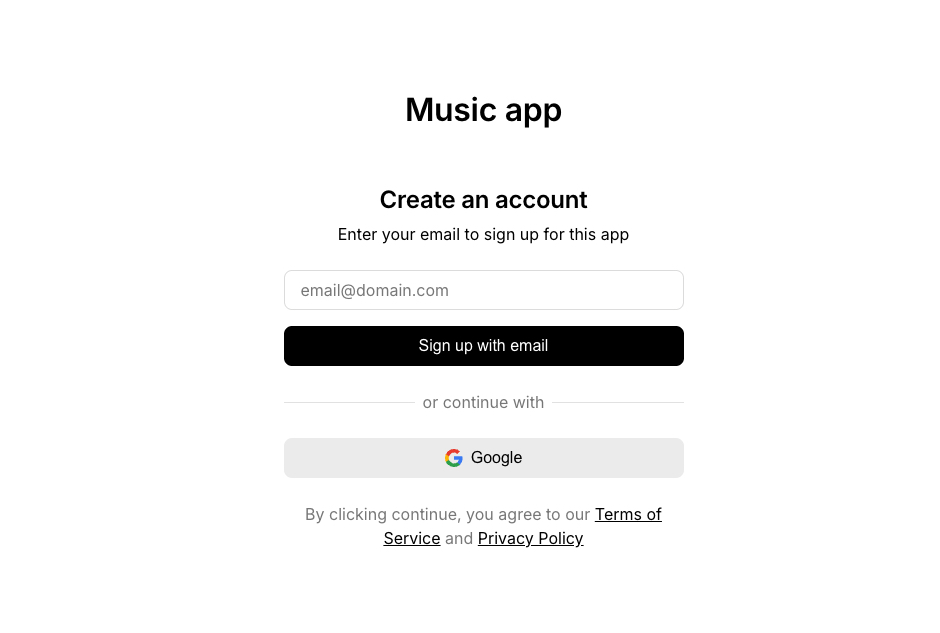

# Cursor + Figma-Context-MCP + Github MCP 实现前端页面和代码提交

## 写在前面（重要）

仅作为技术实现和 MCP 工作流的记录，项目本身不重要

## 1. 设计图预览


## 2. 配置 MCP

需申请 `token`

```json
{
  "mcpServers": {
    "Figma AI Bridge": {
      "command": "npx",
      "args": ["-y", "figma-developer-mcp", "--stdio"],
      "env": {
        "FIGMA_API_KEY": ""
      },
      "fromGalleryId": "GLips.Figma-Context-MCP"
    },
    "GitHub": {
      "command": "npx",
      "args": ["-y", "@modelcontextprotocol/server-github"],
      "env": {
        "GITHUB_PERSONAL_ACCESS_TOKEN": ""
      },
      "fromGalleryId": "modelcontextprotocol.servers_github"
    }
  }
}
```

## 3. 粘贴 figma 路径并执行


## 4. LLM 对话执行

## 5. 执行结束后运行

```bash
npm i && npm start
```

## 6. 实现效果




## 7. 一些感想

- 前后时间从执行到结束差不多 `15min`
- 除了图表，其他还原度我认为可以给到 `99%`
- 头麻
- 想想失业了干点啥
